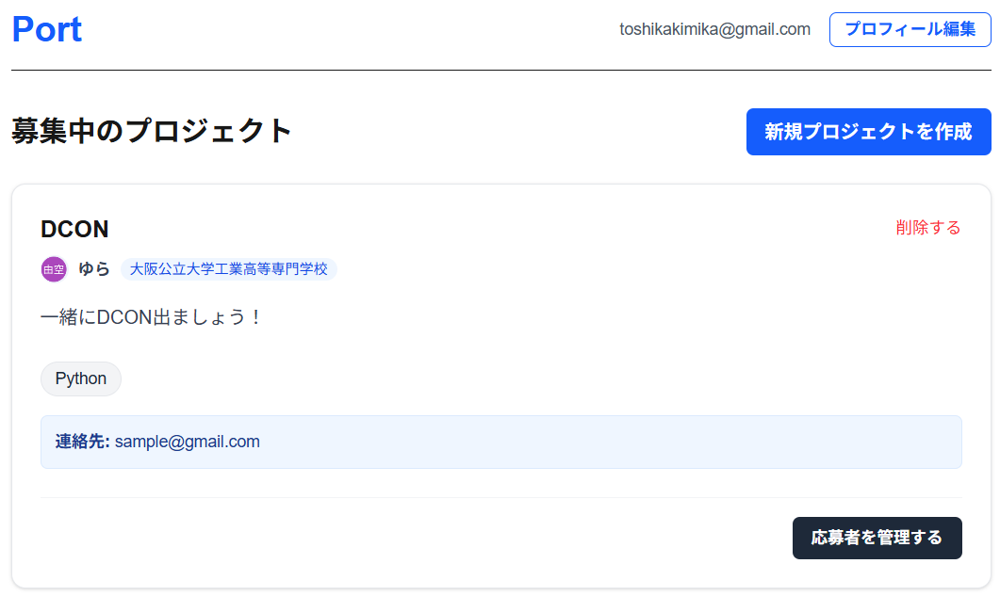
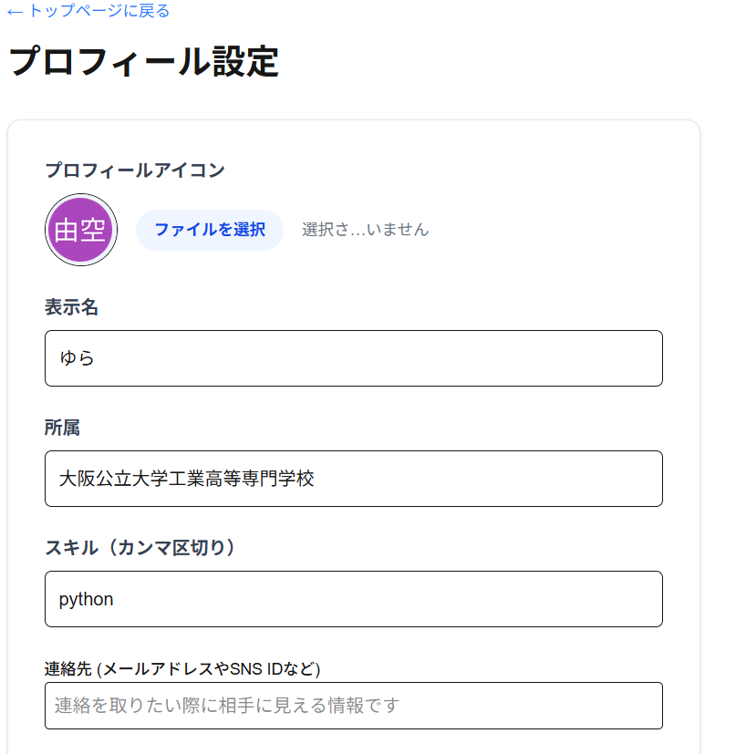
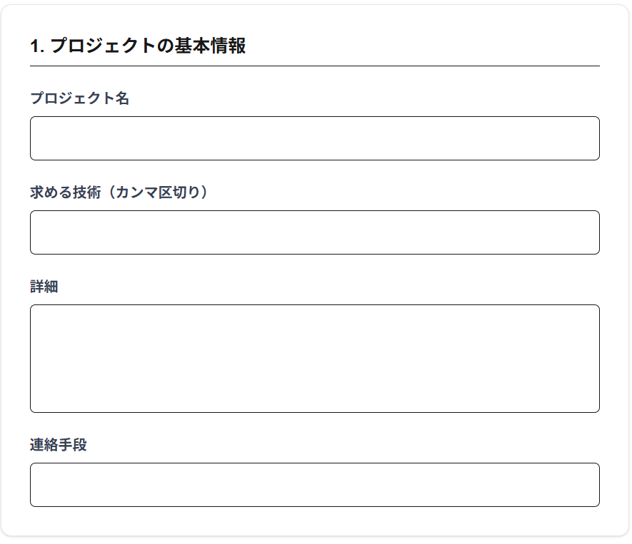
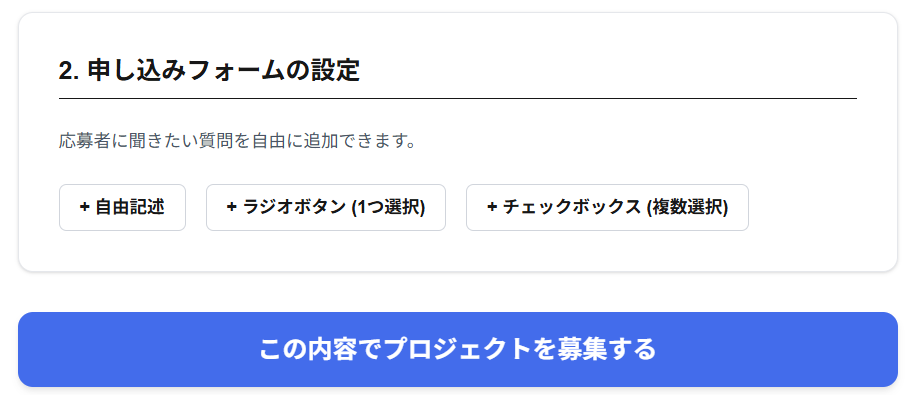
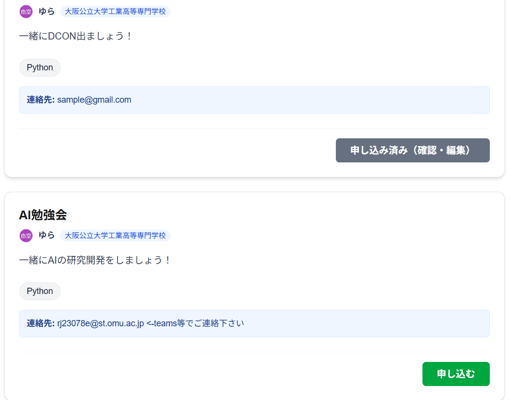
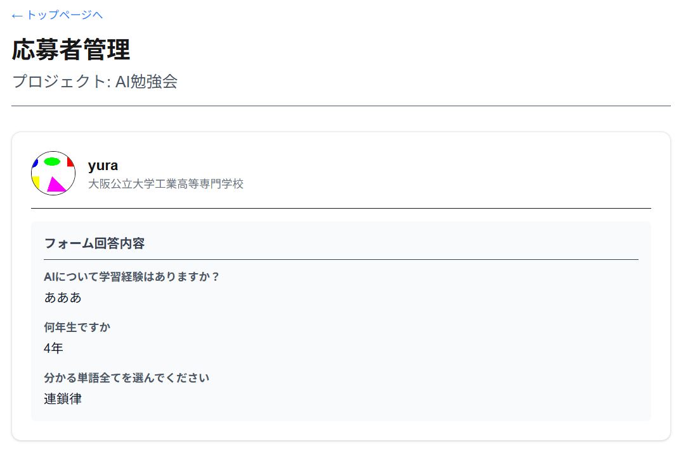
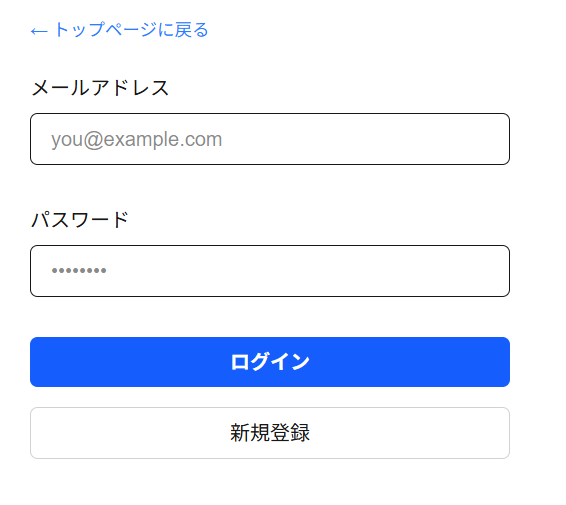

# port - 高専生のためのプロジェクトマッチングプラットフォーム

**公開URL (Vercel):** https://port-eight-xi.vercel.app/

- 初回ログイン時は、メールアドレスとパスワードを入力しEnter
- その後登録したメールアドレスに認証リンクが届くのでそのリンクからアクセス

**開発期間:** 2026.02.16 ~ 2026.02.24 (約【30】時間)

---

## 概要

「port」は、技術者の卵が集まる高専において、学生同士で人材を募り、プロジェクトを立ち上げるためのマッチングアプリケーションです。

アプリ名である「port」には、学生たちがここでのチーム開発や共創を経て、  
「社会へ出航していくための港」になってほしいという願いを込めています。

「コンテストに出たい」「こんなシステムを作りたい」という熱意やアイデアを持つ学生と、  
「何か開発したいけれど、テーマが決まっていない」  
「自分の得意な技術（フロントエンド、AI、ハードウェア等）を活かせる場所を探している」  
という学生を繋ぎ、コミュニティの枠を超えた実践的な開発経験を促進します。

---

## システム紹介

### 1. プロジェクトを探す・見つける（トップページ）



現在募集中のプロジェクトが新着順にカード形式で表示されます。  
自分が応募済みのプロジェクトはステータスが一目でわかるようにUIが変化し、  
スムーズに現在の進行状況を把握できます。

---

### 2. 自分をアピールする（プロフィール設定）



自身の得意な技術スタックやアバター画像を設定し、  
簡易的なポートフォリオとして活用可能です。  
ここで設定した情報が、プロジェクトへ応募する際の  
強力なアピールポイントになります。

---

### 3. 仲間を集める（カスタムフォーム付きプロジェクト作成）




募集するプロジェクトの要件に合わせて、  
独自のアンケート（自由記述、ラジオボタン、チェックボックス等）を  
動的に作成できます。  
これにより、各プロジェクトに最適な人材を的確に募集できます。

---

### 4. プロジェクトへ参画する（シームレスな応募体験）



プロジェクトごとのカスタムフォームに沿って応募するだけでなく、  
応募完了後は自身の回答内容の  
**確認・編集・申し込みの取り消し**までを  
一貫して行える柔軟な設計にしています。

---

### 5. チームを編成する（応募者管理）



誰からどのような回答で応募が来たかを一覧で確認し、  
スムーズにチームメンバーの選定・連絡を行えます。

---

## 主な機能と技術的なこだわり

本システムは、実際の運用を想定し、  
ユーザー体験（UX）とセキュリティの両面にこだわって開発しました。

### 👥 ユーザー体験の最適化
- **柔軟なフォームビルダー**  
  募集者が独自の応募要件を直感的に作成できる機能
- **直感的な画面遷移**  
  ユーザーのアクション（申し込み・情報の更新・削除）完了後、  
  一覧ページへ自動的にリダイレクトするシームレスな設計

### 🔒 セキュリティ・データ保護
- **セキュアな認証**  
  Supabase Authを用いたサインアップ / ログイン

  初回入力時は自動でデータベースへの登録が行われると同時に、登録したメアドへの認証リンク送信も備えている。

  
- **Row Level Security (RLS)**  
  「自分の応募内容のみ編集・削除可能」  
  「投稿者のみがプロジェクトを削除可能」  
  といった厳密なアクセス制御をDBレベルで実装
- **データ不整合の防止**  
  複合ユニーク制約により、  
  同一プロジェクトへの重複応募を完全にブロック

---

## 技術スタック

- **Frontend**: Next.js 15 (App Router), React, Tailwind CSS, TypeScript  
- **Backend / Database**: Supabase (PostgreSQL, Auth, Storage)  
- **Deployment**: Vercel  
- **CI / CD**: GitHub Actions（SupabaseのAuto-pause防止を含む）

---

## 今後の展望

- **アプリ内でのチャット機能**：都度メールや他アプリを挟むのは非効率であるため、ブログアプリのような形式から始め、チャット機能を搭載していきたい
- **参加者の評価機能**：プロジェクトに参加した人同士が評価をしあうことで優秀人材の発掘と取り組み方の改善を促したい
- **プロジェクト管理機能**：そのプロジェクトのタスク管理や納品物のやり取りも本アプリ上で完結できるようにすることでUXの向上を図りたい

---

## ローカルでの環境構築手順

```bash
# 1. リポジトリのクローン
git clone https://github.com/【あなたのユーザー名】/port.git
cd port

# 2. 依存関係のインストール
npm install

# 3. 環境変数の設定
# .env.local を作成し、SupabaseのAPIキーを設定してください
NEXT_PUBLIC_SUPABASE_URL=your_supabase_url
NEXT_PUBLIC_SUPABASE_ANON_KEY=your_supabase_anon_key

# 4. 開発サーバーの起動
npm run dev
# http://localhost:3000 にアクセス
